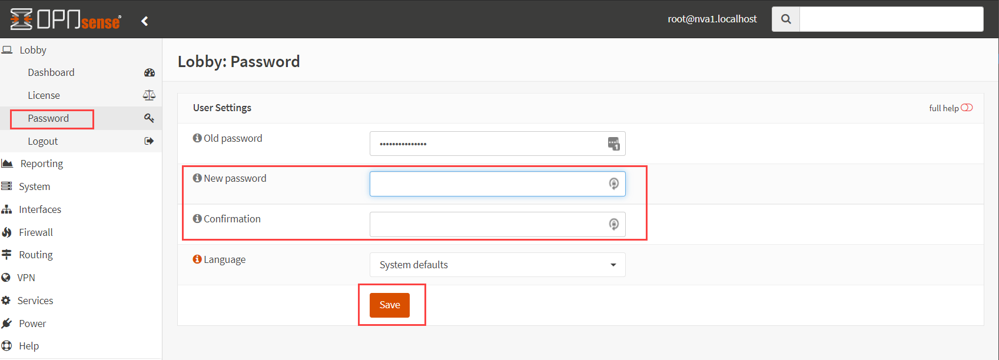
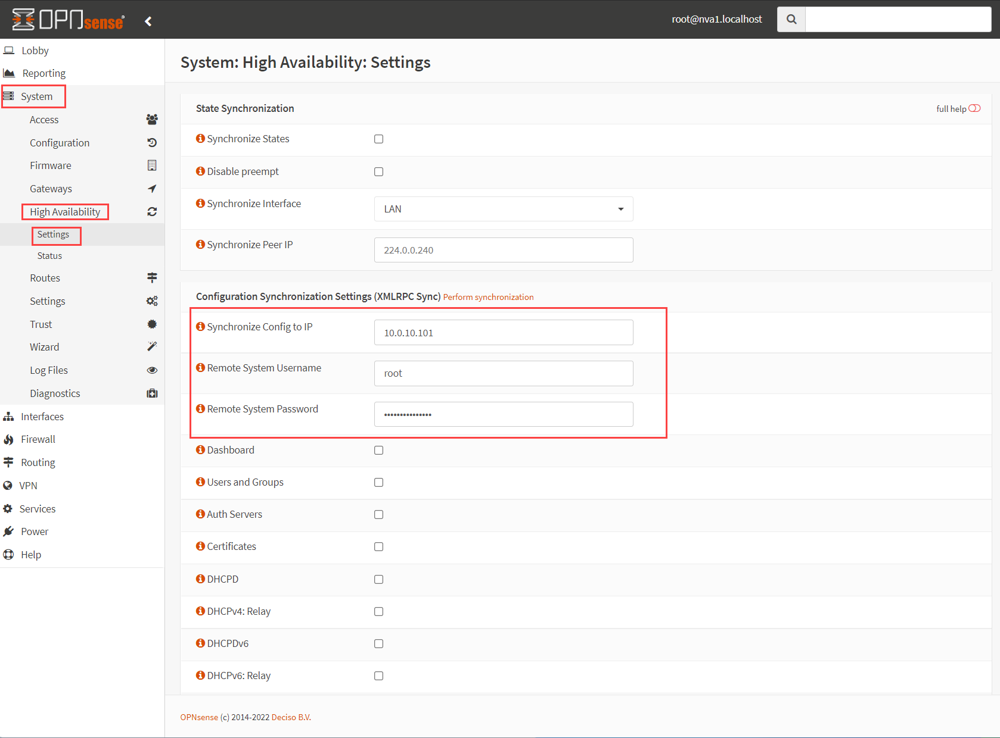
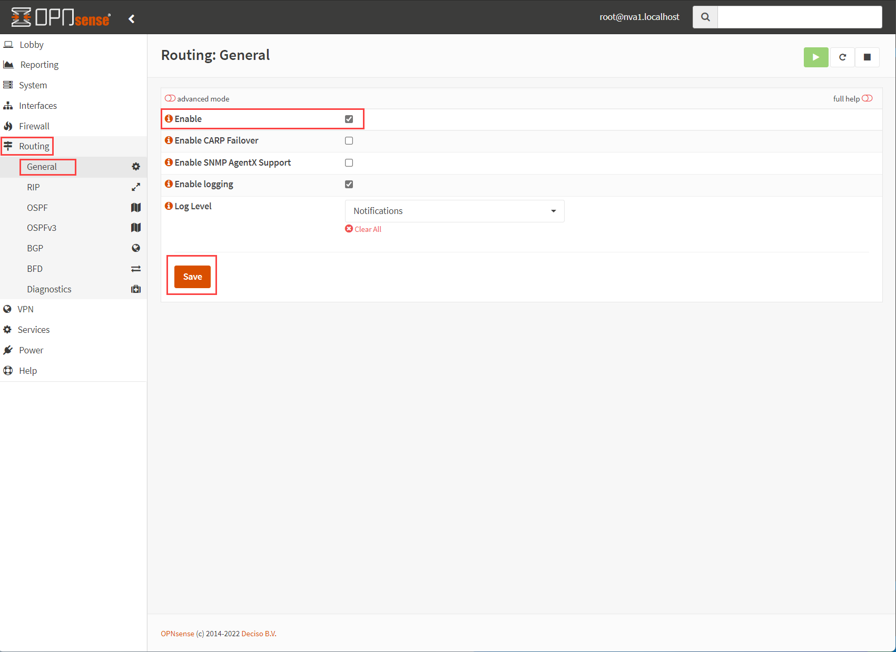
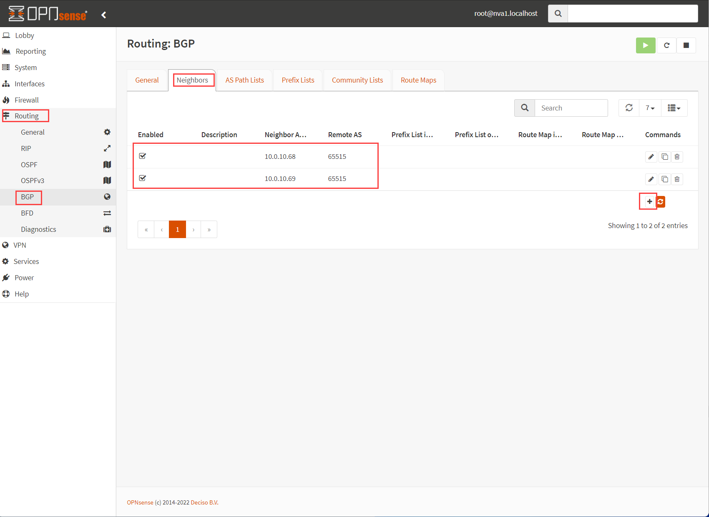
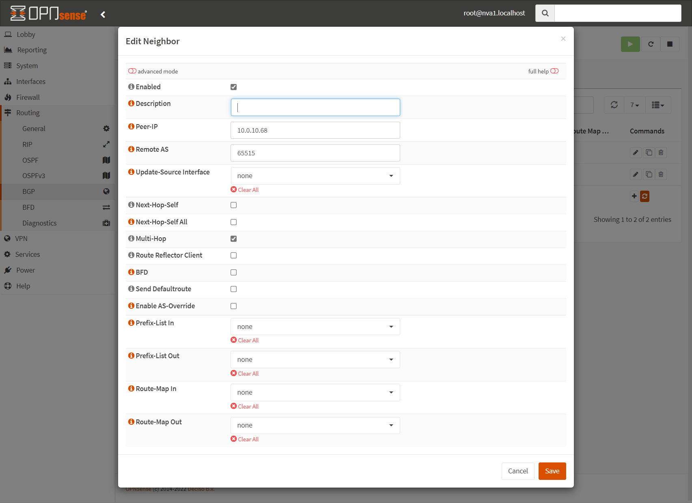
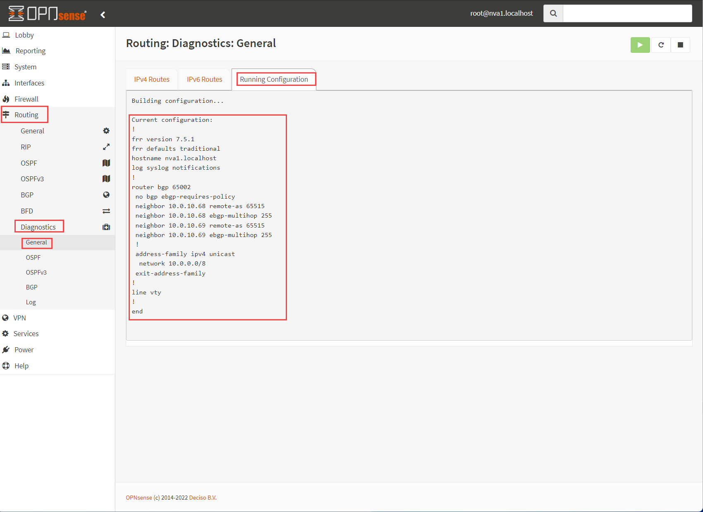
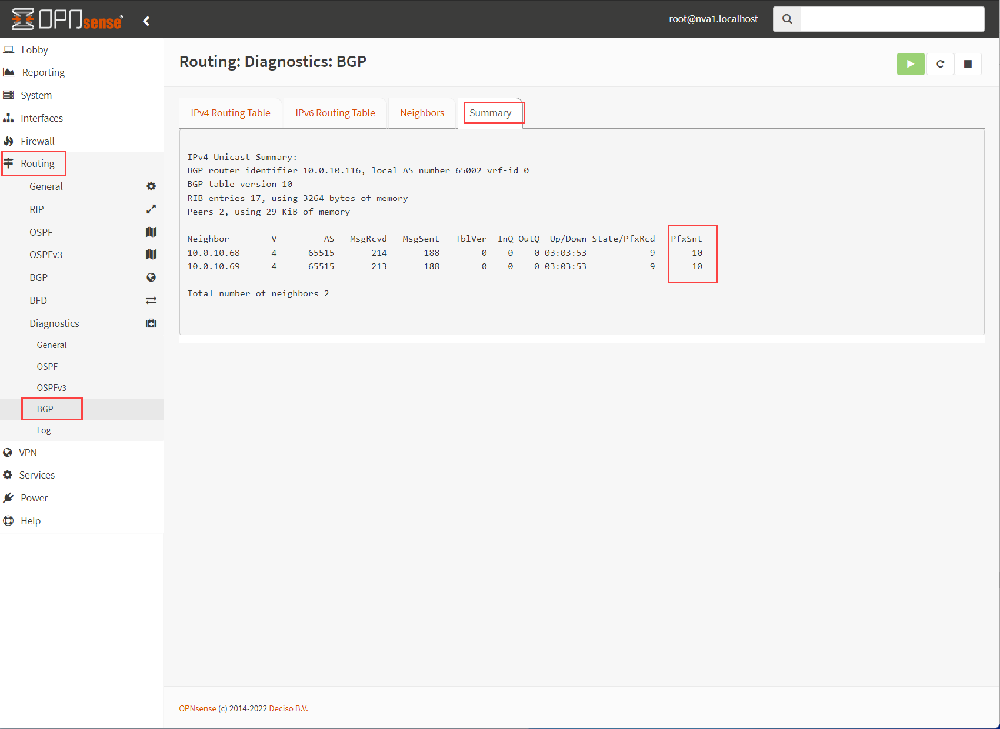

# OPNSense NVA configuration

The following steps are required to OPNSense inject routes via BGP to ASR and inspect traffic:

Access OPNSense configuration UI using its public IP.

#### Step 1 - Change default password

#### Step 2 - Add FRRouting protocol suite plug-in to support BGP

#### Step 3 - Configure configuration synchronization to the second OPNsense instance (NVA2)

#### Step 3.1 - Enable Static Routes, FRR and Firewall rules to be synchronized to the NVA2

#### Step 4 - Configure LAN Firewall rule to allow all traffic

#### Step 5 - Enable FRRouting

**Note:** refresh your browser in case you don't see **Routing** in the left menu.

#### Step 6 - Enable BGP, set AS Number and summary route to be propagated (10.0.0.0/8 or smaller)

#### Step 7 - Configure BGP neighbors using both Azure Route Servers. (see 7.1 for details)

##### Step 7.1 - Neighbor configuration example, make sure to enable Multi-Hop

#### Step 8 - Validate routing configuration

#### Step 9 - In order to summary route to be propagated via BGP you have to make sure the route 10.0.0.0/8 exists on the NVA route table

#### Step 10 - Check if routes are propagating properly. Learned routes from Azure Route Server will get re-propagated as well as new summary route 10.0.0.0/8.

